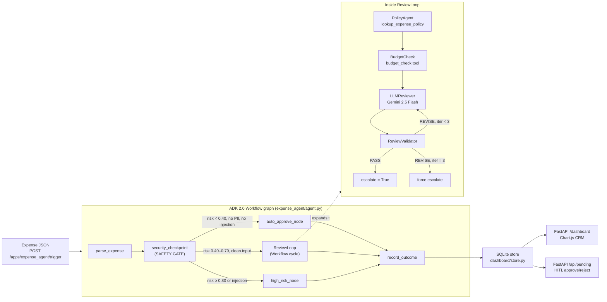
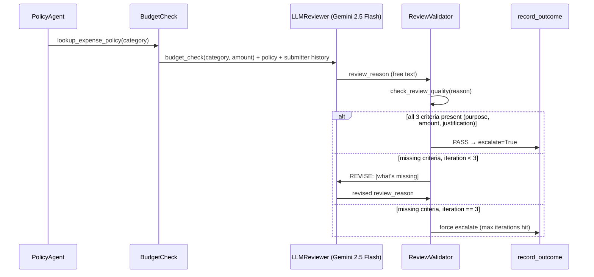

# ExpenseIQ — Architecture

Full system design: data flow, the Workflow graph, the Self-Correcting Review Loop, and the
Safety Gate that sits in front of every LLM call.

---

## 1. High-level data flow



`expense_agent/agent.py` defines a real ADK 2.0 `Workflow` graph, not a `LoopAgent` wrapper — the
review cycle is a native conditional back-edge (`review_validator → {PASS: record_outcome, REVISE:
iteration_guard}`), matching the pattern demonstrated in the course's own Workflow-cycle codelabs.

---

## 2. The Safety Gate (`security_checkpoint`)

This node runs **before every single LLM call**, with no exceptions and no bypass path. It does
three things in order:

1. **PII redaction** — SSN and credit-card regexes run first, so anything downstream (including
   the risk scorer and the LLM reviewer, if it's ever called) only ever sees scrubbed text.
2. **Injection detection** — 10 regex patterns (`ignore\s+previous`, `system\s+override`, etc.).
   A single match sets `risk_score = 1.0` unconditionally — this overrides every other signal.
3. **Risk scoring** — a 0.0–1.0 score combining injection (1.0, terminal), PII presence (+0.3),
   and amount tier (0.10 / 0.40 / 0.75).

```
score >= 0.80  → route: high_risk     (LLM never called)
0.40 <= score < 0.80 → route: llm_review   (ReviewLoop)
score < 0.40   → route: auto_approve  (deterministic, 0 LLM calls)
```

Why this order matters: redaction has to happen *before* scoring, or a PII match inside an
otherwise-clean expense could slip through unredacted into a downstream log or the LLM prompt on a
future revision of the scoring thresholds. Doing it first means the invariant holds regardless of
how the scoring formula changes later.

---

## 3. The Self-Correcting Review Loop



The validator checks three hard, checkable criteria rather than trusting the reviewer's own
confidence: does the reason name a specific business purpose, cite the exact dollar amount, and
state a justification. This is a deliberate design choice — an LLM grading its own free-text
output on vibes is not verification; checking for three concrete, extractable facts is.

---

## 4. Component responsibilities

| Component | File | Responsibility |
|---|---|---|
| Workflow graph | `expense_agent/agent.py` | Wires all 6 core nodes + the ReviewLoop cycle into a single ADK `App` |
| Security | `expense_agent/security.py` | PII redaction, injection detection, risk scoring — pure functions, no LLM |
| Tools | `expense_agent/tools.py` | `lookup_expense_policy`, `budget_check`, `check_review_quality` |
| Store | `dashboard/store.py` | SQLite-backed expense records, `get_stats()` aggregation, seed data |
| API | `dashboard/api.py` | `/api/stats`, `/api/expenses`, `/api/pending`, RBAC-gated HITL endpoints |
| Frontend | `dashboard/static/index.html` | Chart.js CRM — 3 charts + live expense table, polls every 10s |
| Skill | `.agents/skills/expense-validator/` | Level-4 deterministic validator, exit codes, no LLM in the loop |

---

## 5. Why these specific engineering decisions

**Why route high-risk expenses around the LLM entirely, instead of just prompting it to refuse?**
A prompt injection is only dangerous if it reaches a model that has approval authority. Refusing
via a system prompt is a request the model can still be argued out of; never invoking the model at
all removes the attack surface completely. `risk_score >= 0.80` short-circuits to `ESCALATED`
before any Gemini call is made.

**Why a Workflow cycle instead of a single LLM call?** A single review is unverifiable — the model
can omit the amount or give a vague justification and there's no mechanical way to catch it. The
validator's three-criteria check turns "the agent reviewed it" into "the agent reviewed it and the
review is provably complete," with a bounded retry budget (max 3 iterations) so it can't loop
forever on a genuinely ambiguous expense.

**Why deterministic auto-approve below $100, instead of always going through the LLM?** Cost and
auditability. Zero LLM tokens for the majority of traffic, and the approval reason is a readable
Python conditional, not a model's reasoning trace — which matters for a compliance audit trail.

**Why SQLite instead of an in-memory store?** Restarts (including Render's free-tier sleep/wake
cycle) would silently lose all expense history with an in-memory store. SQLite persists to disk;
the trade-off (documented in the README's Limitations section) is that Render's free tier itself
has an ephemeral filesystem, so the *hosted* deployment still resets on redeploy — seed data exists
specifically so the dashboard is never empty on a cold instance.

---

## 6. Known constraints (see README § Limitations for the full list)

- SQLite on Render's free tier lives on ephemeral disk — persists locally, resets on redeploy.
- MCP policy lookup (`lookup_expense_policy`) is a local knowledge base today; the live
  Google Developer Knowledge MCP wiring is on the roadmap, not yet connected.
- HITL approval uses FastAPI endpoints + dashboard buttons rather than ADK's native
  `RequestInput`/`ResumabilityConfig` — a deliberate trade-off for a richer demo UI now, with
  ADK-native resumability tracked as a roadmap item.

---

*Part of [ExpenseIQ](./README.md) — Kaggle AI Agents: Intensive Vibe Coding Capstone 2026.*